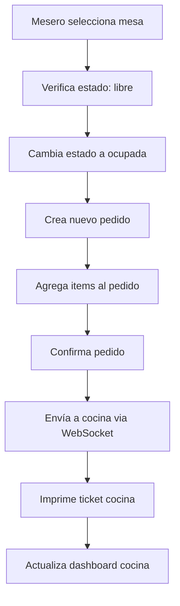
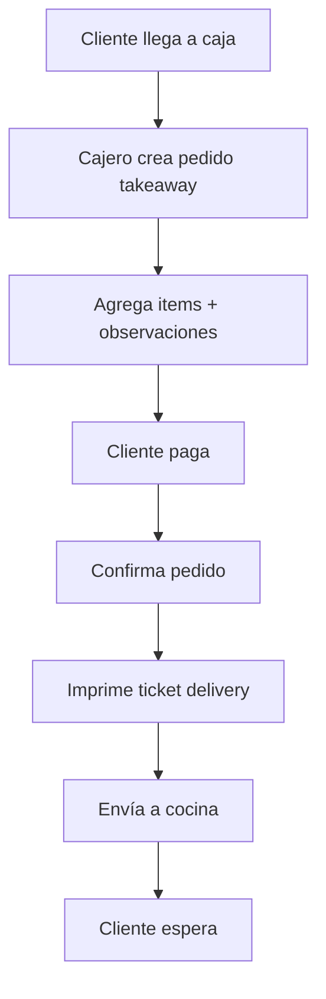

# 📚 Documentación Técnica - Sistema POS La Cabañita

## 🏗️ Arquitectura del Sistema

### **Estructura de Proyectos**
```
📁 la-cabanita-ecosystem/
├── 📁 web-delivery/          # Proyecto actual (sitio web + delivery)
│   ├── app/
│   ├── components/
│   └── lib/
└── 📁 pos-system/            # Nuevo proyecto POS
    ├── app/
    ├── components/
    ├── lib/
    └── printer-configs/
```

## 🛠️ Stack Tecnológico Recomendado

### **Frontend Framework**
- **Next.js 14+** con App Router
- **TypeScript** para type safety
- **React 18** con Server Components

### **Styling & UI**
- **Tailwind CSS** para estilos
- **shadcn/ui** para componentes base
- **Lucide React** para iconos
- **Framer Motion** para animaciones suaves

### **Base de Datos & Backend**
- **Supabase** (compartida con web delivery)
- **PostgreSQL** como motor de BD
- **Row Level Security** para seguridad
- **Realtime subscriptions** para actualizaciones live

### **Estado & Gestión de Datos**
- **Zustand** para estado global
- **React Query/TanStack Query** para cache de datos
- **React Hook Form** para formularios

### **Impresión & Hardware**
- **react-to-print** para impresión web
- **ESC/POS** comandos para impresoras térmicas
- **USB/Network printing** support

### **Autenticación & Seguridad**
- **Supabase Auth** con roles personalizados
- **JWT tokens** para sesiones
- **RBAC** (Role-Based Access Control)

## 🗄️ Estructura de Base de Datos

### **Tablas Principales**

```sql
-- Empleados y roles
employees (
  id, name, role, pin_code, active, created_at
)

-- Control de mesas
tables (
  id, number, capacity, status, current_order_id, assigned_waiter_id
)

-- Pedidos principales
orders (
  id, type, table_id, employee_id, status, total, payment_method, 
  customer_name, observations, created_at, completed_at
)

-- Items del pedido
order_items (
  id, order_id, menu_item_id, quantity, unit_price, modifications
)

-- Menú dinámico
daily_menu (
  id, date, menu_type, items_available, created_by
)

-- Control de asistencia
attendance (
  id, employee_id, check_in, check_out, shift_type, date
)

-- Configuración del sistema
pos_config (
  id, restaurant_name, ruc, address, printer_settings, table_count
)
```

### **Relaciones Clave**
- `orders` → `tables` (many-to-one)
- `orders` → `employees` (many-to-one)
- `order_items` → `orders` (many-to-one)
- `order_items` → `menu_items` (many-to-one)

## 🎯 Módulos del Sistema

### **1. 🔐 Módulo de Autenticación**
```typescript
// Roles del sistema
type UserRole = 'admin' | 'cashier' | 'waiter' | 'kitchen' | 'manager'

// Permisos por rol
const permissions = {
  admin: ['all'],
  cashier: ['orders', 'payments', 'reports'],
  waiter: ['orders', 'tables'],
  kitchen: ['orders_view', 'order_status'],
  manager: ['reports', 'menu_management']
}
```

### **2. 🪑 Módulo de Mesas**
- **Estados**: `free`, `occupied`, `reserved`, `cleaning`, `out_of_service`
- **Funciones**: Asignar mesa, liberar mesa, cambiar estado
- **Vista en tiempo real**: WebSocket para actualizaciones

### **3. 📝 Módulo de Pedidos**
```typescript
type OrderType = 'dine_in' | 'takeaway' | 'delivery'
type OrderStatus = 'pending' | 'preparing' | 'ready' | 'served' | 'paid' | 'cancelled'

interface Order {
  id: string
  type: OrderType
  status: OrderStatus
  table_id?: number
  items: OrderItem[]
  total: number
  created_at: Date
}
```

### **4. 🎫 Módulo de Ticketeras**
```typescript
// Configuración de impresoras
interface PrinterConfig {
  name: string
  type: 'kitchen' | 'delivery' | 'receipt'
  ip_address?: string
  port?: number
  paper_width: 58 | 80 // mm
}

// Formato de tickets
const ticketFormats = {
  kitchen: {
    header: 'COCINA - LA CABAÑITA',
    sections: ['order_number', 'table', 'items', 'observations', 'timestamp']
  },
  delivery: {
    header: 'DELIVERY - LA CABAÑITA',
    sections: ['order_number', 'customer_name', 'items', 'total', 'timestamp']
  }
}
```

### **5. 💰 Módulo de Caja**
- **Métodos de pago**: Efectivo, Tarjeta, Yape, Plin, Transferencia
- **Facturación SUNAT**: Integración con API de facturación
- **Arqueo**: Control de apertura/cierre de caja

### **6. 📊 Módulo de Reportes**
- **Ventas por período**: Día, semana, mes
- **Rendimiento por mesero**: Ventas, tiempo promedio
- **Platos más vendidos**: Ranking de popularidad
- **Análisis de mesas**: Rotación, tiempo promedio

## 🔄 Flujos de Trabajo Técnicos

### **Flujo: Toma de Pedido en Mesa**


### **Flujo: Pedido Para Llevar**


## 🚀 Pasos de Implementación

### **Fase 1: Configuración Base (Semana 1)**
1. **Setup del proyecto Next.js**
   ```bash
   npx create-next-app@latest pos-cabanita --typescript --tailwind --app
   cd pos-cabanita
   npm install @supabase/supabase-js zustand react-query
   ```

2. **Configuración de Supabase**
   - Crear tablas en la BD existente
   - Configurar RLS policies
   - Setup de Realtime subscriptions

3. **Estructura de carpetas**
   ```
   app/
   ├── (auth)/
   ├── dashboard/
   ├── orders/
   ├── tables/
   ├── kitchen/
   ├── cashier/
   └── admin/
   ```

### **Fase 2: Módulos Core (Semana 2-3)**
1. **Sistema de autenticación**
   - Login con PIN para empleados
   - Middleware de roles
   - Protección de rutas

2. **Gestión de mesas**
   - Vista grid de mesas
   - Estados en tiempo real
   - Asignación de meseros

3. **Toma de pedidos**
   - Interfaz touch-friendly
   - Carrito de pedidos
   - Validaciones

### **Fase 3: Ticketeras y Cocina (Semana 4)**
1. **Sistema de impresión**
   - Configuración de impresoras
   - Formatos de tickets
   - Queue de impresión

2. **Panel de cocina**
   - Vista de comandas
   - Estados de preparación
   - Notificaciones

### **Fase 4: Caja y Reportes (Semana 5)**
1. **Módulo de caja**
   - Procesamiento de pagos
   - Facturación
   - Arqueo de caja

2. **Sistema de reportes**
   - Dashboard de analytics
   - Exportación de datos
   - Gráficos interactivos

### **Fase 5: Integración y Testing (Semana 6)**
1. **Integración con web delivery**
   - API compartida
   - Sincronización de menú
   - Estados unificados

2. **Testing y optimización**
   - Pruebas de carga
   - Optimización de performance
   - Testing en dispositivos reales

## 🔧 Configuración de Hardware

### **Impresoras Térmicas Recomendadas**
- **Cocina**: Epson TM-T20III (80mm)
- **Delivery**: Epson TM-T20III (58mm)
- **Recibos**: Epson TM-T20III (80mm)

### **Dispositivos**
- **Tablets**: iPad 10.9" o Samsung Galaxy Tab A8
- **Router**: Para red local estable
- **UPS**: Respaldo de energía

## 🔗 Integración con Sistema Web

### **APIs Compartidas**
```typescript
// Endpoints comunes
/api/menu/items          // GET, POST, PUT
/api/orders             // GET, POST, PUT
/api/tables             // GET, PUT
/api/reports            // GET
/api/sync               // POST (sincronización)
```

### **Base de Datos Unificada**
- **Menú**: Compartido entre ambos sistemas
- **Pedidos**: Diferenciados por tipo (web/pos)
- **Reportes**: Consolidados

## 📈 Métricas de Performance

### **Objetivos de Rendimiento**
- **Tiempo de respuesta**: < 200ms para operaciones básicas
- **Uptime**: 99.9% disponibilidad
- **Concurrencia**: Soporte para 10+ usuarios simultáneos
- **Impresión**: < 3 segundos por ticket

### **Monitoreo**
- **Logs de errores**: Sentry o similar
- **Métricas de uso**: Analytics personalizados
- **Health checks**: Endpoints de salud

## 🛡️ Seguridad y Backup

### **Medidas de Seguridad**
- **Encriptación**: HTTPS en todas las comunicaciones
- **Autenticación**: PIN + roles granulares
- **Auditoría**: Log de todas las operaciones críticas
- **Backup**: Automático cada 6 horas

### **Recuperación ante Desastres**
- **Backup local**: Base de datos local de emergencia
- **Modo offline**: Funcionalidad básica sin internet
- **Sincronización**: Auto-sync al restaurar conexión

---

## 🎯 Próximos Pasos

1. **Crear proyecto POS** con Bolt.new usando el prompt
2. **Configurar base de datos** con las tablas necesarias
3. **Implementar módulos** según las fases definidas
4. **Testing en ambiente real** del restaurante
5. **Integración final** con sistema web existente

**¡Sistema POS robusto y escalable para La Cabañita!** 🚀